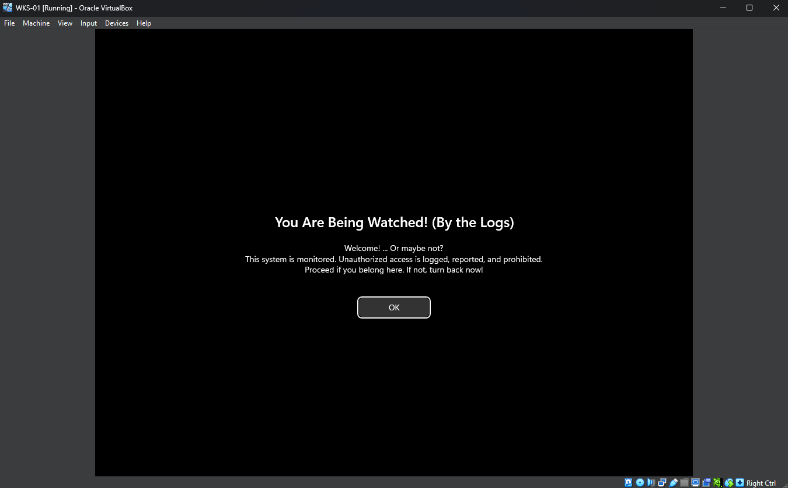
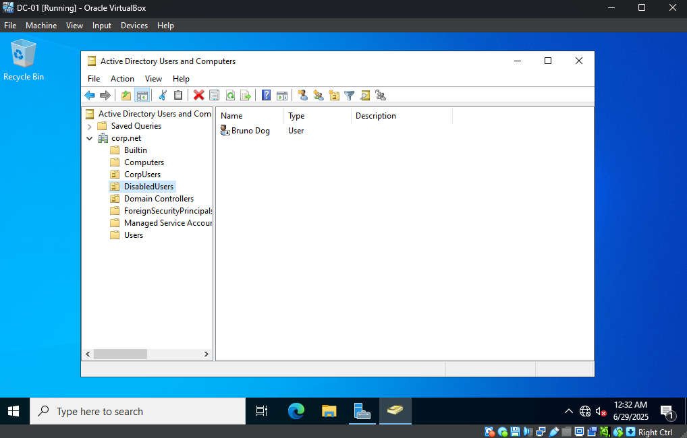

# Active Directory Automated Lab

A Windows Server environment which features automated identity lifecycle management, Group Policy enforcement,         
and secure domain configuration.

---

### Milestones

* **Deployed hardened AD forest** (`corp.net`) on Windows Server 2022 with DNS integration
* **Enforced security policies** using GPO including:
  - Mandatory logon banners
  - Secure client configurations
* **Automated domain-join process** for Windows 11 clients over bridged networking
* **Implemented user lifecycle workflows**:
  - Provisioning through automated processes
  - Secure decommissioning procedures

---

### Technology Stack

* **Core Services:** Active Directory, Group Policy (GPO), DNS
* **Server OS:** Windows Server 2022
* **Client OS:** Windows 11 Enterprise
* **Automation:** PowerShell
* **Virtualization:** Oracle VirtualBox
* **Version Control:** Git

---

### Workflow Implementation
*User lifecycle processes are automated with PowerShell (see sample scripts in `scripts/` directory)*

*Figure: Configured GPO login banner enforcing corporate security policy*

*Figure: Result of the offboarding automation, showing a disabled user moved to the 'DisabledUsers' OU.*
